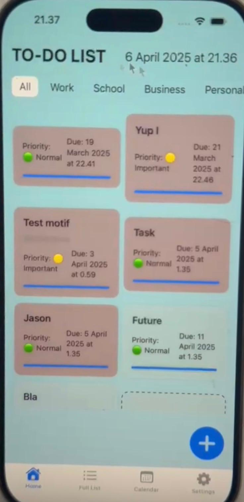

# JJ To-Do List

A native iOS task management app built with SwiftUI, developed collaboratively by **Jason Gunawan** and **Jason Opoku**. Designed to help users organize, track, and manage daily tasks across multiple categories with smart reminders and an intuitive interface.

---

## Preview

<p align="center">
  
</p>

---

## Features

### Task Management
- **Create** tasks with a title, description, due date/time, priority level, and category
- **Edit** any task inline via a dedicated detail screen
- **Delete or complete** tasks individually, or clear all tasks at once (with confirmation)
- **Quick-add** tasks via a floating popup modal without leaving the current screen

### Organization
- **5 categories** — Work, School, Business, Personal, Other
- **3 priority levels** — Urgent 🔴, Important 🟡, Normal 🟢 — shown as visual indicators on each card
- **Category filter bar** on the home screen to instantly narrow the view
- **Search** tasks by title from the Full List tab

### Calendar View
- Graphical calendar picker to browse tasks by date
- Highlights dates that have tasks assigned
- Displays a contextual message when no tasks exist for a selected date

### Notifications & Reminders
- **Scheduled local notifications** triggered at the task's due time
- **Configurable reminder offset** — set reminders anywhere from 1 to 1,440 minutes (24 hours) before a task is due
- Overdue tasks are **highlighted in red** across all views
- Notification permissions managed in-app from the Settings tab

### Settings
- Toggle **light/dark mode** preference
- Enable or disable **push notifications**
- Adjust **reminder timing** with a stepper control
- **Clear all tasks** with a single destructive action (confirmation required)

### Data Persistence
- All tasks are saved locally using **UserDefaults** with JSON encoding — no internet connection required
- Settings (theme, notification preferences, reminder offset) persist across launches

---

## Architecture & Technical Design

This project follows a **simplified MVVM (Model-View-ViewModel)** architecture using SwiftUI's reactive data binding system.

```
JJToDoList/
├── Models/
│   └── Task.swift              # Codable data model with computed properties
├── ViewModel/
│   └── TaskManager.swift       # ObservableObject — CRUD, persistence, notifications
├── Views/
│   ├── SplashScreen.swift      # Animated launch screen
│   ├── MainTabView.swift       # Root tab navigation (4 tabs)
│   ├── HomeScreen.swift        # Dashboard with category filter & grid layout
│   ├── FullList.swift          # Searchable list with swipe-to-delete
│   ├── Calender.swift          # Date-picker based task browser
│   ├── AddTaskScreen.swift     # Full task creation form
│   ├── TaskDetailScreen.swift  # Task editing and completion
│   └── Settings.swift          # App preferences
├── Components/
│   ├── Components.swift        # Reusable UI components (TaskCard, HeaderView, etc.)
│   └── PopUp.swift             # Custom ViewModifier for modal overlays
└── JJToDoListApp.swift         # @main entry point
```

### Key Design Decisions

| Decision | Approach |
|---|---|
| State management | `@StateObject` / `@ObservedObject` with a single shared `TaskManager` |
| Persistence | `UserDefaults` + `Codable` JSON — lightweight, no external dependencies |
| Notifications | `UserNotifications` framework with `UNCalendarNotificationTrigger` |
| UI layout | `LazyVGrid` for the home grid, `List` with swipe actions for the full list |
| Modals | Custom `ViewModifier` (`PopupModifier`) for consistent popup behavior |

---

## Tech Stack

| Layer | Technology |
|---|---|
| Language | Swift 5 |
| UI Framework | SwiftUI |
| State Management | Combine (`@ObservableObject`, `@State`, `@Binding`, `@AppStorage`) |
| Persistence | UserDefaults + Foundation (Codable / JSONEncoder) |
| Notifications | UserNotifications framework |
| Minimum Target | iOS 16+ |
| IDE | Xcode |

---

## Getting Started

### Prerequisites
- macOS with **Xcode 14** or later installed
- An iOS 16+ simulator or physical device

### Running the App

1. Clone or download this repository
2. Open `JJToDoList.xcodeproj` in Xcode
3. Select a simulator or connected device from the toolbar
4. Press **⌘ + R** to build and run

No third-party dependencies or package managers are required — the project uses only Apple's native frameworks.

---

## Screenshots

| Home Screen | Calendar View | Settings |
|---|---|---|
| Category filters, priority indicators, and grid layout | Browse tasks by date with the built-in calendar | Manage notifications, theme, and reminders |


---

## Testing

The project includes both unit and UI test targets generated by Xcode:

- **JJToDoListTests** — Unit tests for core logic
- **JJToDoListUITests** — UI automation tests

Run tests with **⌘ + U** in Xcode.

---

## Authors

**Jason Gunawan** — [@jason29.gunawan](mailto:jason29.gunawan@gmail.com)

**Jason Opoku**

---

## License

This project was built for educational purposes as part of an iOS development learning journey. All rights reserved by the authors.
